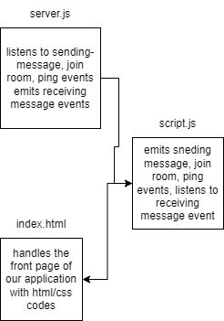

# Simple Messaging system using socket.io

We used socket.io to create a server that handle events comming from client front end. Created a simple chatbox that can have multiple clients, everytime the chatbox is rendered it will create a new socket with a socket id. clients can interact with each others using the messaging system.
clients can either chat publicly with all other connected clients or they can chat privately using the socket id of a different client, or they can join a room and chat with anyone else inside that room.

- also created an admin namespace using the adming-ui and `https://admin.socket.io`;

## events

- sending messages:
  - the server is listening to messages that are being sent from the front end and checks if there was a specific room then sends the message either to all othe clients or to the clients that are in that specific room
  - the client emits a sending-messages event everytime they submit a message by clicking the button send
- receiving messages:
  - the server emits the receiving-message event after the sending-messages event is triggered and either broadcast the message to all other clients or to clients that are in a specific room
  - the client is listening for the receiving-message event and handles the message that was sent to display it on the chat-box
- joining room:
  - the server is listening to join-room revent and when emitted from a client it will send the client to a room.
  - the client emits the join-room event when they click they enter a room name and click the button join in the front end.
- ping:
  - the server is listening to the ping event and logs a number count.
  - the client starts a count everytime they connect and emits the count on a time interval of 1 sec

## UML

